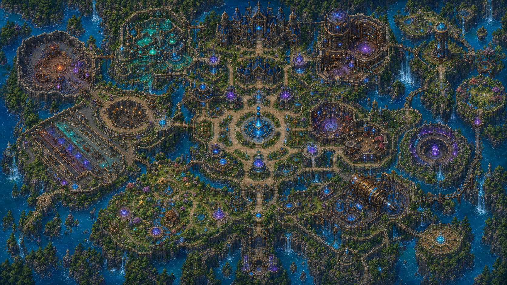

# FLUX 2

FLUX 2 is a fast, top-down magic-and-chemistry arena shooter about mastering
movement, shaping reactive battlefields, and turning elemental rules into
deliberate plays. It is both the Godot 4 reimplementation of FLUX and the
production workspace in which those ideas are made deterministic, hostable,
testable, and expandable.

The target is not a conventional twin-stick shooter with elemental damage
types painted over static rooms. Players preserve momentum through a deep
universal movement grammar, combine character and loadout abilities, and
manipulate a bounded 2.5D material simulation: water conducts Charge, oil
spreads fire, heat creates steam, cold freezes routes, impacts fracture cover,
and immutable `worldbone` guarantees that a match can never destroy its own
critical topology.

## Game and implementation map

Checkboxes report repository truth on the current branch: checked means the
named foundation and its tests exist; unchecked means planned or in progress,
even when design documentation already exists.

- [x] **Chapter 1 — [Product promise](#product-promise)**
  - [x] [Design pillars](#design-pillars)
  - [x] [Player loop](#player-loop)
  - [x] [Reference principles and originality boundary](#reference-principles-and-originality-boundary)
  - [x] [Visual and audio identity](#visual-and-audio-identity)
- [ ] **Chapter 2 — [The Sanctum](#the-sanctum)** — data/visual foundation
  complete; authored multi-layer runtime map in progress
  - [x] Nine combined districts and three-layer layout contract
  - [x] Validated attunement-node and fail-closed fast-travel rules
  - [x] Playable schematic mechanics court (not accepted Sanctum art/topology)
  - [ ] Authored Nexus-to-Conservatory world slice matching the approved scale,
    dense-edge/clear-lane composition, district landmarks, and pixel direction
  - [ ] Offline-complete stations plus privacy-safe friends/presence, simple
    host/join, host teams/rules/practice/travel tools, and Garuda Sway/Windows
    acceptance
  - [ ] Walk-up stations, overlay menu state machine, map UI, streaming, and
    destination persistence
- [ ] **Chapter 3 — [Movement and traversal](#movement-and-traversal)**
  — deterministic universal grammar in progress
  - [x] Sprint, counter-strafe, hop/double jump, wall kick, air redirect/dodge,
    wavedash, slide/slide jump, vault, superglide, and landing cut
  - [x] Ordered integer collision, per-wall lockout, speed ceiling, explicit
    launch/grapple/charge/stun/root/slow contracts, and 60/120 Hz route/replay
    verification
  - [x] Separate Health, Stamina, and spell Flux; independent quantized aim and
    keyboard/mouse/controller action defaults
  - [x] Offline saved keyboard bindings, world-relative and aim-relative
    movement presets, and full/ranged-cone POV with 15–360° angle and adjustable
    range
  - [x] Edgeweave swept hostile near-miss reward with speed, cooldown,
    miss-vs-hit, full-Stamina, training, and per-projectile farming guards
  - [ ] Add variable hop/fast fall, bounded impact influence, ground recovery,
    wall skims, authored elevation, compact body-lift/shadow jump presentation,
    input buffering, interactive binding UI, controller profile persistence, and
    interactive route acceptance
- [ ] **Chapter 4 — [Aiming, combat, and abilities](#aiming-combat-and-ability-composition)**
  - [x] Independent move/aim and held-primary command protocol
  - [x] Resource-free Arc Primary and Flux-paid Vector Lance through startup,
    deterministic projectile, swept hit, damage, cooldown, and replay
  - [x] Stable ability/wire IDs, canonical hashes, affinity discounts, gated
    elements, slot validation, and an exact 13-point foundation loadout
  - [ ] Complete targeting families, defense/clash/launch/status rules, passive,
    three actives, mobility, ultimate, formula variants, and configuration UI
  - [ ] First complete champion vertical slice
- [ ] **Chapter 5 — [Elements, chemistry, and destruction](#elements-chemistry-and-destruction)**
  - [x] Deterministic reactive-material and immutable-worldbone design contract
  - [x] Validated material registry, bounded packed 128 x 128 Material Yard
    seed, separate Charge/elevation fields, immutable perimeter/plinth,
    deterministic work queue, hashes, exact reset, and read-only preview
  - [ ] Structural damage and the first live material reactions; the first
    eight element families remain staged and Spirit/Chaos/Gravity/Time gated
  - [ ] Structural fracture, fluids, fire/heat, ice, Charge, gases, residues,
    cleanup, reset, replication, and readable reaction presentation
- [ ] **Chapter 6 — [Ancestries and champions](#ancestries-and-champions)**
  - [ ] Versioned ancestry/body budgets for the existing twenty foundations and
    an original three-body-plan arachnoid family
  - [ ] Reconcile the 23 named designs, temporary Angel slot, visual references,
    affinities, statistics, lore approval, and fighting-game selection grid
  - [ ] One champion at a time through selection, bots, network, replay,
    accessibility, original per-character taunt, and platform gates
- [ ] **Chapter 7 — [Maps and world interactions](#maps-and-world-interactions)**
  - [x] Worldbone, map-package, reset-group, route, hazard, objective, and
    mutable-region contracts
  - [ ] Multi-elevation arena kit, devices, moving surfaces, traversal helpers,
    destructible shortcuts, biome reactions, validators, and modular maps
- [ ] **Chapter 8 — [Modes and networking](#modes-networking-and-progression)**
  - [x] Host-authority, protocol, prediction, reconnect, spectator, and
    host-migration contracts
  - [ ] Living Sanctum friend presence/join and host administration before other
    modes; ENet host/join vertical slice, duel/team/objective PvP, cooperative PvE,
    PvPvE extraction/convergence, roguelike dungeons, lane/stronghold modes,
    battle royale, bots, and measured scale beyond eight players
- [ ] **Chapter 9 — [Production roadmap](#production-roadmap)**
  - [x] Pinned Godot, headless suites, Linux offline setup, CI definition, and
    original visual-direction provenance
- [x] Focused reversible checkpoints A–E remain playable and published
  - [x] Checkpoint F1 establishes chemistry storage/worldbone/reset safety
  - [x] Checkpoint G1 adds persisted controls and configurable POV
  - [ ] G2 begins the Living Sanctum V1 track: authored world, body/jump,
    reactions/interactions, first ancestry/champion/spells, friends/host tools,
    then Garuda Sway/Windows acceptance before other modes

The complete gate order, slice boundaries, current status, and definition of a
working checkpoint live in the [FLUX 2 overhaul implementation plan](docs/OVERHAUL-PLAN.md).



The image above is an original visual target, not collision geometry or a final
tile set. Its palette, district scale, magical-travel language, layered island
structure, and dense handcrafted pixel-art character define the starting hub
direction.

## Reference principles and originality boundary

FLUX 2 studies successful design principles without reproducing protected
content. Every sprite, sound, name, character, ability, map, mode presentation,
icon, font, animation, layout, and line of code must be original or carry a
compatible documented license.

| Broad reference | Principle considered | Original FLUX 2 interpretation |
| --- | --- | --- |
| Titanfall/Apex family | Movement routes, momentum conversion, readable traversal objects, independent aim, squad legibility | A stamina-bounded universal movement grammar in authored top-down elevation lanes; champion mobility never bypasses collision or the global speed ceiling |
| Super Smash Bros. Melee | Commitment, recovery, precise landing timing, momentum expression, bounded launch influence | Top-down landing cuts, wavedash geometry, readable startup/active/recovery phases, and future collision-safe impact influence—without copying characters, stages, move data, or control layout |
| Classic handheld Zelda games | A top-down jump reads instantly through compact body lift, a grounded shadow, apex, and crisp landing | An original authoritative elevation arc and original body/shadow presentation; no copied sprite, frame, timing, sound, map, input, or item behavior |
| Hades / Hades II | Strong room silhouettes, layered depth, dramatic landmarks, dense scenic edges, responsive ambience, and clear combat floors | Original pixel-perspective Sanctum districts with FLUX materials, architecture, palette ramps, props, routes, lighting, UI, and interaction grammar; no copied rooms, assets, camera metrics, palette, symbols, or trade dress |
| Noita | Materials and spells producing systemic consequences | A deterministic, host-authoritative, bounded 2.5D chemistry grid with reset groups, work budgets, explicit ownership, and immutable worldbone |
| Magicka | Element composition as a learnable casting language | Versioned Flux Formulas made from approved source, geometry, operation, and catalyst components; competitive recipes are hashed content, not arbitrary unvalidated packets |
| League of Legends | Skillshot clarity, role composition, cooldown/resource decisions, objective pressure | Shape-first aimed abilities, loadout roles, contestable terrain, and modular objective rules without copying champions, abilities, map topology, terminology, or presentation |
| StarCraft/Warcraft | Strong faction/body silhouettes and asymmetric strategic identity | Original ancestry body plans and bounded physical budgets; ancestry never grants automatic spell-damage superiority and no existing faction, creature, lore, or visual design is imported |
| The FINALS | Destruction creating tactical routes | Authored structural layers and contestable shortcuts whose collapse can never destroy spawn safety, objectives, or critical topology |

These references are design-review shorthand, not dependencies or acceptance
criteria. When a reference conflicts with FLUX 2 readability, determinism,
fairness, accessibility, performance, or originality, the FLUX 2 rule wins.

## Product promise

A successful FLUX 2 encounter should let a new player understand why they were
hit, let a practiced player express a personal movement style, and let an expert
discover useful interactions that remain explainable and reproducible. The game
should feel fast without becoming visually noisy, systemic without becoming
random, and competitive without sacrificing expressive PvE, co-op, training,
social, or experimental modes.

### Design pillars

1. **Movement is a weapon.** Walking, sprinting, counter-strafing, hops, wall
   kicks, double jumps, redirects, air dodges, wavedashes, slides, vaults, and
   superglides share one learnable grammar. Momentum creates options rather than
   bypassing level design.
2. **Chemistry changes decisions.** Materials and elemental fields alter cover,
   traction, visibility, conductivity, routes, hazards, and ability behavior.
   Reactions are telegraphed, deterministic, bounded, and resettable.
3. **Readability outranks spectacle.** Silhouette, shape, motion, timing, sound,
   value, and residue communicate state. Color supports those channels but is
   never the only one.
4. **Depth comes from composition.** Races, characters, abilities, equipment,
   elements, terrain, objectives, and teammates create combinations with
   explicit costs and counterplay instead of one dominant build.
5. **Every mode uses the same rules.** Training, local play, hosted PvP, co-op
   PvE, PvPvE, bots, spectating, and replay analysis share one authoritative
   simulation and content registry.
6. **Players can own the session.** Linux and Windows players can host directly;
   optional signalling or relay services are replaceable and self-hostable.
   Offline solo, bots, training, local tools, documentation, and development
   remain fully usable without a subscription.

## Player loop

The Sanctum is the persistent starting, training, social, and configuration
space. A player learns or tunes a build there, joins a hosted session or chooses
an expedition, enters a resettable arena, then returns with mastery, records,
cosmetic expression, and newly attuned destinations—not power that invalidates
competitive fairness.

Moment to moment:

```text
read terrain -> choose a route -> preserve or spend momentum
      -> cast / fire / interact -> trigger material reactions
      -> read the changed arena -> reposition, counter, or commit
```

Combat should support precise projectiles, shaped fields, melee or contact
techniques, movement attacks, deployables, defensive conversions, and utility.
Aim, collision, damage, cooldowns, reaction ownership, and material mutations
belong to the deterministic simulation; animation, particles, camera, and audio
present confirmed outcomes.

## The Sanctum

The hub is a vast magical academy-fortress spread across a central island,
satellite terraces, rooftop routes, an undercroft, suspended gardens, and
outbound gates. Related activities are combined into memorable districts rather
than isolated menu booths:

- the **Nexus Court** anchors onboarding and the attunement network;
- the **Wayfarer Concourse** combines social, appearance, host/join, modes, and
  expedition staging;
- the **Movement Conservatory** combines fundamentals, advanced routes, races,
  and traversal labs;
- the **Alchemical Proving Grounds** combines aim, bots, destructibles, and safe
  elemental reaction basins;
- the **Living Archive** combines lore, codex, replays, analytics, and research;
- the **Verdant Recovery** combines rest, ingredients, interaction practice,
  dummies, and low-pressure crafting;
- the **Foundry Deep** houses fabrication, the transmutation engine, and the
  flooded undercroft;
- the **Crown Observatory** combines settings, accessibility, diagnostics, and
  session monitoring;
- the **Seasonal Expanse** offers shifting biome pockets and private trials.

Local movement remains rewarding, but distance is never busywork. The central
fountain and district shrines form a diegetic fast-travel network. A shrine must
be discovered and attuned once; unlocked destinations can then be selected from
any safe shrine. Combat, scripted trials, and invalid destinations fail closed.
See [the Sanctum contract](docs/SANCTUM-HUB.md) and its versioned
[map definition](content/maps/sanctum_hub_v1.json).

### Living Sanctum V1 — first acceptance test

The first accepted product is the Sanctum itself, not an isolated duel or
chemistry demo. It must feel spacious, charming, inhabited, and coherent while
serving as the fully functional application shell. Nexus, movement, chemistry,
social/muster, champion/loadout, archive/guide, settings, recovery, and service
areas need memorable silhouettes, layered elevation, clear ordinary routes,
rewarding advanced routes, environmental responses, and fast travel.

Offline users can arrive, onboard, configure, train, inspect builds/guide,
interact, reset laboratories, traverse, save, and quit without a service. When
connected, the muster/friends surface shows privacy-safe presence such as
offline, online, away, in Sanctum/activity, joinable, invite-only, full, or
incompatible, with a clear reason when joining is unavailable. Direct/LAN and
validated invite joining remain primary; any directory, signalling, or relay is
replaceable and self-hostable.

The host can form/name/color/lock teams, invite/assign/auto-balance players,
choose explicit friendly-fire/self-damage/healing/collision policy, manage
privacy/readiness/late join/spectators/bots, run/reset trials and dummies,
restore practice resources, set shared waypoints, initiate validated group
travel or opted-in announced practice ports, moderate, inspect diagnostics, and
end cleanly. Changes are permission-checked, visible, rate-limited, logged, and
frozen where competition demands it; hosting never grants remote file/shell or
client-setting control.

Foreground terrain, roofs, foliage, buildings, and constructs fade/cut away or
yield to an ownership-readable silhouette when they overlap a character that is
inside the viewer's authoritative line of sight. A character outside LOS is not
revealed by silhouettes, labels, shadows, effects, audio markers, or debug UI.

Acceptance is co-equal on Garuda Linux with Sway and supported Windows: source
and packaged launch, input/window/audio behavior, saves, networking, reconnect,
performance, accessibility, cleanup, and uninstall/rollback evidence. See the
[Living Sanctum V1 acceptance contract](docs/SANCTUM-V1-ACCEPTANCE.md).

## Movement and traversal

Movement must feel expressive at ordinary speed and become deep through timing,
route knowledge, and composition—not through undocumented exploits. Universal
actions spend Stamina; spells and champion actions spend Flux. A character may
specialize in movement, but ancestry, loadout, map devices, or a champion skill
cannot disable ordered collision, erase recovery, or exceed the authored global
speed ceiling.

### Control reference and point of view

Control style and information presentation are independent player choices. The
default `world_relative` preset keeps W/A/S/D aligned to the screen while aim
remains independent. The `aim_relative` preset treats mouse/right-stick aim as
forward: W/S move along facing and A/D strafe perpendicular to it. Neither
preset changes movement tuning or authority; both compile to the same bounded
world-space command fields before tick zero processing.

The default `full` view exposes the whole local viewport. The optional `cone`
view follows aim and accepts an exact integer angle from 15 through 360 degrees
and a range from 160 through 4096 world units. A 360-degree cone is therefore a
circular ranged view, distinct from unrestricted full view. This checkpoint is
a local presentation option; competitive hidden information must later be
host-enforced, and clients may never use a preference to reveal state the mode
did not replicate.

Current physical keyboard bindings, movement reference, view mode, angle, and
range persist in an offline versioned profile. See
[player controls and POV](docs/PLAYER-CONTROLS-AND-POV.md) for hotkeys, exact
command-line values, the editable JSON schema, bounds, and future Settings
station acceptance.

### Universal movement grammar

| Action | Tactical purpose | Commitment and counterplay | Runtime status |
| --- | --- | --- | --- |
| Move + independent aim | Strafe, lead targets, hold crossfire, and retreat without surrendering aim | Acceleration, braking, and counter-strafe timing preserve readable momentum | Implemented |
| Sprint | Pursuit, disengagement, and objective rotation | Continuous Stamina drain and delayed recovery; loud/visible movement signature planned | Implemented |
| Hop / double jump | Clear ground pressure and vary elevation/timing | Paid edges, bounded aerial options, explicit landing state | Foundation implemented; authored elevation pending |
| Slide / slide jump | Commit low and fast, then convert late into a longer route | Entry-speed gate, weak steering, Stamina cost, recovery, and hard cover stops | Implemented |
| Air redirect / air dodge | Correct one line or make one committed aerial escape | Limited use, high cost, fixed duration, collision-safe recovery | Implemented |
| Wavedash | Convert a late angled air dodge into grounded momentum | Exact landing geometry, one queued conversion, no free stacking | Implemented |
| Wall contact / wall kick | Rebound from a brief valid wall-contact window | Stable wall identity and a 220 ms same-wall lockout prevent loops | Implemented |
| Vault / superglide | Cross marked low cover and convert the narrow crest window | Only authored vault surfaces qualify; destination clearance and fixed ceiling are mandatory | Implemented against foundation geometry |
| Landing cut | Trade a timed landing input for reduced recovery and route continuity | Never deletes an attack/status commitment and must remain readable | Foundation implemented |
| Edgeweave | Skim the swept edge of a hostile projectile at committed speed to regain Stamina | No reward on hit, full Stamina, training pressure, low speed, cooldown, or repeat contact | Implemented |
| Variable hop / fast fall | Change aerial duration and contest timing without a new jump | Bounded elevation curve and explicit landing recovery | Planned |
| Impact influence / brace | Bend a launched trajectory slightly or time a safe ground recovery | Cannot cancel knockback, cross worldbone, or remove the attacker’s earned advantage | Planned |
| Wall skim | Run briefly along an authored traversable wall | Stamina drain, maximum duration, exit recovery, same-surface lockout | Planned |

The input layer will buffer only named transitions for short real-time windows
compiled independently at 60 and 120 Hz. It will not buffer arbitrary actions
through stun, charge, grapple, menus, or network correction. Every action has a
semantic event and a presentation state, so tutorials, bots, replay analysis,
audio cues, and accessibility assists consume the same truth.

### Traversal interactions

Map traversal extends the universal grammar through visible authored objects:

- rails, grind lines, ropes, ziplines, lifts, moving platforms, pressure vents,
  launch surfaces, spring growth, water currents, wind lanes, portals, and
  grapple anchors;
- marked vault/ledge profiles, wall-skim bands, breakable shortcuts, collapsing
  floors, doors, gates, switches, pressure plates, relays, and counterweights;
- ice, mud, oil, water depth, rubble, webbing, vegetation, smoke, steam, low
  gravity, and other surfaces that modify traction, visibility, acceleration,
  or route availability through explicit bounded rules;
- champion mobility that targets a valid anchor, direction, or destination and
  pays Flux rather than masquerading as free universal movement.

An interaction declares ownership, activation shape, capacity, cooldown,
failure reason, collision behavior, network authority, reset group, and
accessibility cue. A moving platform carries riders through deterministic
relative motion; a zipline cannot teleport through blocked geometry; a grapple
must resolve a visible anchor and safe arc; a destructible shortcut must leave a
valid route after collapse.

### Route and movement acceptance

Every competitive map provides at least three understandable route classes: a
low-risk ordinary route, a faster committed route, and a situational route
created or changed by combat/material state. Each route is measured at both
tick rates for completion time, maximum speed, Stamina/Flux cost, failure
recovery, collision clearance, camera readability, bot navigation, and an
accessibility alternative. No advanced technique is required to leave spawn,
reach an objective, or recover from fast travel.

## Aiming, combat, and ability composition

FLUX 2 combines shooter precision with fighter commitment. Moving never points
the character’s aim automatically. Mouse, right stick, keyboard aim, bots, and
replay commands all produce the same quantized direction; the simulation owns
the final ray, sweep, projectile, volume, or placement query.

### Aim language and targeting

| Targeting family | Examples of decisions | Required read |
| --- | --- | --- |
| Projectile | Lead, intercept, weave, clash, reflect, or use cover | Origin, direction, speed class, radius, ownership, element, impact, expiry |
| Ray / beam | Hold a lane, sweep deliberately, interrupt a channel | Startup line, active duration, obstruction, break state, recovery |
| Arc / cone / contact | Commit close, punish movement, protect a flank | Facing, reach, active window, launch direction, punishable recovery |
| Ground or elevation volume | Deny, cleanse, heal, reveal, slow, or prime terrain | Exact boundary, elevation band, activation delay, duration, owner, escape |
| Placed geometry | Create cover, a prism, bridge, trap, relay, or structure | Placement validity, construction time, health/support, collision, destruction answer |
| Tether / channel | Pull, sustain, transfer, guide, or contest | Source/target line, range, interruption, occlusion, sever rule |
| Mobility target | Dash, grapple, vault, launch, swap, or redirect | Destination/anchor validity, path, collision, safe landing, recovery |

Competitive assists may tune stick response, dead zone, sensitivity, reticle
contrast, target friction, limited slowdown, and motion/audio indicators. They
never fabricate a hit, lead perfectly, see concealed targets, alter canonical
projectiles, or differ by network authority. Training-only lead and trajectory
previews are labeled and unavailable where a mode forbids them.

### Fighter rules inside a shooter

Attacks and defenses use explicit startup, active/travel, impact, recovery,
cooldown, ownership, interruption, and expiry phases. Planned combat depth
includes projectile clash priority, guard/parry/absorb/reflect roles, shields
with visible break state, typed stagger and launch, bounded victim impact
influence, collision-safe ground recovery, pierce/bounce/split rules, channels,
fields, deployables, status cleansing, and friendly-fire policy per mode.

Cancel routes are an authored graph, never an animation accident. Hit pause,
camera impulse, particles, and controller rumble may emphasize a confirmed
event but cannot delay or create authority. Every damaging or controlling
action exposes a reaction window or a deliberate positional answer; unavoidable
combos require an explicit short cap and escape rule.

### Resources and loadout

| Layer | Contract |
| --- | --- |
| Health | Defeat resource; recovery begins only after the authored no-damage delay and remains mode configurable |
| Stamina | Universal movement resource for sprinting, hops, slides, air actions, wall routes, and selected recovery techniques |
| Flux | Spell/champion resource; casting delays recovery and insufficient Flux refuses the cast before outcome creation |
| Ultimate charge | Earned through active combat/objective contribution; never passive waiting, self-damage, or target-dummy farming |
| Passive | One champion-defining behavior with a demonstrated trigger, visible state, and anti-farming lockout |
| Primary | Reliable independent-aim pressure that remains useful at zero Flux |
| Active slots | Three unique catalog abilities inside the mode budget; damage, defense, support, terrain, control, and mobility are roles rather than mandatory duplicates |
| Champion mobility | One identity-bearing Flux-paid traversal/combat action, still bounded by collision and speed rules |
| Ultimate | One high-impact commitment with startup, safe routes, ownership, interruption/destruction, expiry, and recovery rules |

The standard competitive active budget is 13 points. An affinity may reduce an
aligned active’s build cost to its declared minimum; it never silently
multiplies damage, healing, duration, radius, control strength, or resource
capacity. Alternative modes may publish a different budget as part of their
hashed ruleset rather than mutate a live match.

### Flux Formulas

The expandable magic layer is a validated formula system, not an unbounded
runtime scripting language. A formula composes approved components:

```text
source family + geometry + operation + optional catalyst + constraints
      -> stable ability variant ID + canonical parameters + counterplay
```

- **Source family** supplies Earth, Fire, Water, Wind, Ice, Charge, Light,
  Dark, or a later approved family.
- **Geometry** chooses a bolt, ray, arc, pulse, field, wall, tether, orbit,
  structure, trail, or movement route.
- **Operation** describes physical intent such as heat, cool, wet, charge,
  push, pull, lift, bind, fracture, grow, decay, cleanse, reveal, refract, or
  redirect.
- **Catalyst** is a second approved element, carried reagent, device, champion
  hook, or material already present in the arena.
- **Constraints** declare cost, points, startup, recovery, cooldown, targeting,
  capacity, cell/entity budgets, ownership, friendly fire, cleanup, and every
  counterplay rule.

Authored recipes compile to stable IDs and content hashes before selection.
Competitive play exposes a curated legal catalog; the Proving Grounds, custom
games, and roguelike modes may expose larger experimental catalogs while using
the same validator. A client can request only an approved formula ID—never send
arbitrary damage, reaction, or geometry parameters to the host.

## Elements, chemistry, and destruction

Elements describe magical intent; materials describe arena state. Neither is a
hidden damage wheel. A Fire champion is not automatically stronger against an
Ice champion. Power comes from aim, timing, geometry, material preparation,
movement, ownership, and the opponent’s visible responses.

| Family | Spatial/chemical identity | Runtime gate |
| --- | --- | --- |
| Earth | Mass, stone, metal, growth, structure, roots, fracture, grounded routes | Catalog enabled; chemistry pending |
| Fire | Heat, ignition, ash, smoke, spreading pressure, delayed bursts | Catalog enabled; chemistry pending |
| Water | Flow, pressure, wetness, current, cleansing, displacement | Catalog enabled; chemistry pending |
| Wind | Directional pressure, sound, push/lift, projectile bending, gas motion | Catalog enabled; chemistry pending |
| Ice | Cooling, brittle matter, frozen terrain, friction, shatter setup | Catalog enabled; chemistry pending |
| Charge | Conductivity, stored force, linked devices, interrupt, delayed discharge | Catalog enabled; projectile foundation live |
| Light | Refraction, reveal, life, healing, geometric protection | Catalog enabled; chemistry pending |
| Dark | Decay, death, blood, shadow, concealment, sacrifice, attrition | Catalog enabled; chemistry pending |
| Spirit | Psyche, dream, resolve, illusion, memory, possession boundaries | Declared but runtime gated |
| Chaos | Entropy, instability, mutation, spatial failure, dangerous rule disruption | Declared but runtime gated |
| Gravity | Weight, pull, orbit, anchoring, curved trajectories, vertical commitment | Declared but runtime gated |
| Time | Delay, haste, echo, recorded state, bounded rewind, cooldown distortion | Declared but runtime gated |

The initial chemistry laboratory uses bounded packed cells and at least
worldbone, stone, brick, timber, metal, glass, soil, vegetation, water, oil,
fire, steam, smoke, ice, Charge, and rubble. It proves deterministic heat,
wetness/flow, ignition, freezing, conductivity, structural damage, derived
collision, reset, replay, and semantic network correction before additional
materials are promoted.

Representative decisions include water conducting a warned Charge discharge;
oil moving before it burns; Fire and Water creating occluding steam; Water and
Ice creating a breakable low-friction route; thermal shock cracking glass or
stone; Earth and Water creating mud; Wind driving gases and loose matter; Light
refracting through a temporary prism; growth creating cover that can later burn;
and collapse producing rubble that changes movement without deleting worldbone.

### Destruction safety

Every map separates three structural layers:

1. **Worldbone** is immutable critical topology: outer bounds, spawn safety,
   objective foundations, essential portals, reset machinery, and minimum
   connectivity.
2. **Authored structure** is staged and destructible: walls, floors, supports,
   doors, bridges, glass, devices, trees, and cover with typed damage and clear
   damaged states.
3. **Transient matter** is bounded match state: liquids, gases, loose solids,
   fields, residues, growth, debris, and ability-created geometry with explicit
   capacity and cleanup.

Support loss enters a warned failure stage before ordered collapse. Safety
validators prove spawn clearance, objective access, route minima, resetability,
active-cell limits, debris limits, and immutable-mask hashes before a map can be
selected. Competitive cleanup is predictable; PvE may allow longer persistence
but still obeys hard budgets.

## Ancestries and champions

“Race” in older notes maps to **ancestry** in current content. An ancestry owns
body geometry, locomotion hooks, anatomy attachments, material read, size range,
and bounded physical modifiers. A champion separately owns identity, posture,
equipment, affinities, passive, primary, mobility, ultimate, voice/audio, lore,
and visual profile. A loadout then selects catalog actives. This separation lets
new champions reuse tested body plans without copied renderers or changed
competitive hitboxes.

### Ancestry body-plan catalog

The twenty FLUX foundations remain design inputs. The arachnoid expansion adds
three provisional original body plans; names and lore remain subject to author
approval before player-facing use.

| Ancestry/body plan | Direction and bounded gameplay hooks |
| --- | --- |
| Human | Adaptable gear-led silhouette; no extreme body advantage |
| Dwarf | Broad grounded form, structure resistance, slower route profile |
| Gnome | Tiny device specialist, low health/mass, compact readable equipment |
| Hobbit | Low profile and recovery focus, increased launch vulnerability |
| Elf | Tall precise posture and air control, fragile body budget |
| Orc | Heavy commitments and bounded interruption resistance, slower recovery |
| Troll | Huge enduring body, delayed recovery, very readable actions |
| Minotaur | Forward momentum and structural impact, poor turning/miss recovery |
| Seakin | Fins and water-route steering whose value depends on authored currents |
| Wyrmborn | Scaled wing silhouette and one strong aerial commitment, reduced Stamina |
| Stoneborn | Braced mineral mass and structure synergy, slow movement |
| Treefolk | Rooted stability and growth hooks, large fire-vulnerable presentation |
| Sylph | Streamer-wing air control with very low health and mass |
| Undead | Remnant/rune anatomy, reduced ordinary healing, explicit restoration rules |
| Goblin | Fast tool-led play and bounded salvage, fragile body |
| Nymph | Bloom/support interactions whose power depends on readable reactions |
| Vampire | Controlled pursuit and interruptible sustain through Dark/blood setup |
| Werewolf | Forward-weighted breaker with strong commitment and weak turning |
| Angel | Feather-wing visual/body foundation only; permanent champion identity remains unapproved |
| Demon | Angular redirect silhouette without sexualized anatomy or religious caricature |
| Weaverkin (provisional arachnoid) | Low, wide eight-limb runner with authored wall/web route hooks; normalized combat footprint and no passive wall bypass |
| Scorpionkin (provisional arachnoid) | Braced pincers and segmented tail with long readable attack attachments; armor/mass paid by speed, radius, and recovery budget |
| Harvestkin (provisional arachnoid) | Tall long-limbed sensor/stride profile with fragile joints and clear ground footprint; reach never silently enlarges hitboxes or spell damage |

Size classes modify only bounded Health, recovery, speed, acceleration, mass,
footprint, knockback response, air control, camera/readability, and traversal
clearance. Auxiliary arms, wings, tails, roots, horns, fins, and arachnoid legs
declare presentation bones and ability anchors; they are not surprise hitboxes
or free attacks. Every ancestry must fit standardized navigation footprints or
an explicitly tested large-body class.

### Existing character design roster

The following FLUX designs are migration inputs, not automatically selectable
Flux2 content. “Void” is an unresolved older label and must be explicitly mapped
to Dark, Chaos, or a separately approved family before affected champions can
enter the runtime.

| Champion | Ancestry | Draft affinities | Intended identity |
| --- | --- | --- | --- |
| Oh Tipi | Seakin | Water, Ice, Charge | Conductive-field skirmisher and current rider |
| S. Wayne | Hobbit | Dark, Light | Eclipse-boundary tactician and decoy router |
| The Red Baron | Undead | Void, Fire, Ice | Airborne formation controller with punishable landings |
| Steezo | Goblin | Fire, Charge, Light | Volatile construct engineer and detonation sequencer |
| Treevor the Mason | Treefolk | Earth, Wind, Fire | Terrain mason creating routes, cover, and fire liabilities |
| Oll' I | Werewolf | Earth, Fire, Light | Forward structural breaker with high commitment |
| Fluup | Orc | Charge, Wind, Ice | Storm bruiser converting committed landings |
| Wa Bidi | Goblin | Charge, Wind, Fire | Fast battlecry route specialist with visible/audio cues |
| Grace Reava | Sylph | Wind, Water, Light | Luminous-current aerial duelist |
| Nico Lai | Gnome | Charge, Light | Precision shared-device engineer |
| Spai Si | Demon | Wind, Light, Earth | Redirect duelist converting hostile intent into angles |
| Leaf the Hidden | Treefolk | Water, Earth, Light | Concealed grove support and planned-route grower |
| Ha Rekt | Wyrmborn | Ice, Wind, Fire | Aerial cold-line hunter with marked escape routes |
| Dr. Apex | Stoneborn | Earth, Light, Water | Armored combat medic with contestable support zones |
| Haara | Nymph | Light, Wind, Spirit | Bloom planner with flexible resource routing |
| Hesus Christo | Elf | Earth, Water | Tall renewal vanguard rebuilding broken routes |
| Grimm Bow | Troll | Void, Earth, Water | Terrain archer converting displacement into precision, never bonus damage |
| Biggy Bob | Dwarf | Earth, Fire, Light | Forge-line breacher and masonry specialist |
| Jan Wicked | Human | Ice, Dark, Charge | Black-ice circuit hunter |
| Ba Djoh | Minotaur | Earth, Fire, Water | Three-current charge breaker |
| Urzh | Stoneborn | Earth, Fire, Charge | Conductive kiln bulwark and lane anchor |
| Donnok | Dwarf | Earth, Fire, Water | Forge-rhythm terrain shaper |
| Djonah Thaan | Vampire | Dark, Charge, Fire | Grave-current pursuit controller |
| Unnamed Angel | Angel | Wind, Light, Spirit | Visual placeholder only; identity, lore, and kit unapproved |

New arachnoid champions occupy expansion slots only after the three body plans,
names, lore, silhouettes, skeletons, movement clearance, trait budgets, and one
complete kit are reviewed. No placeholder becomes selectable merely to fill a
roster column.

### Champion promotion pipeline

One champion is promoted at a time through stable definition/wire IDs, ancestry
budget, six displayed statistics, legal loadout, passive/primary/actives/
mobility/ultimate, training dummy, bot behavior, local replay, network authority,
reconnect, spectator view, accessibility cues, Linux/Windows source launch,
package smoke, a unique interruptible semantic taunt, and visual/audio
acceptance. Character-specific mechanics may
extend validated systems but may not introduce a private physics engine,
material simulation, status language, or network rule.

## Maps and world interactions

A FLUX 2 map is a versioned package, not one monolithic scene. It contains
immutable topology, elevation/traversal bands, mutable material seeds, collision
and navigation sources, spawns, objectives, devices, portals, interaction
anchors, reset groups, active-simulation regions, presentation layers, and
canonical hashes.

| Map layer | Responsibilities |
| --- | --- |
| Topology/worldbone | Bounds, minimum routes, spawn/objective safety, portal foundations, critical supports |
| Elevation | Ground height, low cover, ledges, overpasses, bridges, undercrofts, projectile/vision bands |
| Structural shell | Typed destructible walls, floors, roofs, supports, doors, glass, vegetation, devices |
| Material seed | Solids, loose matter, liquids, gases, coatings, temperature, wetness, charge, residues |
| Traversal graph | Ordinary paths, advanced chains, accessibility alternatives, bot costs, interaction anchors |
| Objective graph | Capture/escort/extract/defend/deliver/spawn relationships independent of decoration |
| Reset and budget regions | Deterministic restoration, awake-cell/entity limits, cleanup and mode overrides |
| Presentation | Original tiles, props, parallax/elevation read, audio zones, landmarks, weather, non-authoritative effects |

World interactions include doors and switches; destructible circuits; pumps,
sluices, turbines, furnaces, capacitors, prisms, mirrors, lifts, cranes, bells,
traps, bridges, and portals; harvestable or reactive vegetation; movable cover;
neutral creatures; hazards; and mode objectives. Devices expose typed ports for
pressure, flow, heat, Charge, Light, physical impact, ownership, and reset, so a
map can compose systems rather than add bespoke scene scripts.

Arena layouts must support readable lanes without becoming static corridors.
Elevation creates over/under routes and projectile bands; destruction opens
temporary angles; fluids and gases cross boundaries only through authored
permeability; and objectives force players to choose between controlling the
current arena state and preparing the next rotation. Dense art frames playable
space but never hides collision, danger, ownership, or the minimum safe route.

## Modes, networking, and progression

Modes are versioned rulesets over the same authoritative simulation. A mode
selects player/team limits, maps, actors, spawn/defeat rules, objectives,
scoring, round flow, legal catalogs, material budgets, persistence, late join,
spectating, bot fill, and network requirements. It does not fork movement,
combat, chemistry, or champion implementations.

Hosted Sanctum presence, joining, and lobby administration are application
infrastructure and therefore precede these gameplay modes. PvP, PvE, PvPvE,
roguelike, stronghold, battle-royale, and custom mode claims begin only after
Living Sanctum V1 passes its full foundation and two-platform acceptance matrix.

| Family | Planned first expression | Production gate |
| --- | --- | --- |
| Training / freeplay | Sanctum practice, field guide, configurable dummy/bot, chemistry reset, movement time trials | Fully offline, instant reset, instrumentation, accessibility paths |
| First Rite / campaign onboarding | Short authored sequence teaching movement, aim, one reaction, one objective, return to Sanctum | Skippable/replayable, no hidden permanent power, save migration |
| PvP duel | 1v1 stock/round and timed variants on one compact arena | Spawn fairness, rematch, replay, bots, latency/loss, deterministic results |
| Team PvP | 2v2–4v4 skirmish, control, delivery, territory, draft/mirror variants | Team readability, objective telemetry, role diversity, no dominant composition |
| Cooperative PvE | Survival and siege with enemy families, elites, bosses, hazards, difficulty and revive rules | Deterministic AI, save stability, scalable encounter budgets, drop-in/out policy |
| PvPvE expedition | Teams contest neutral threats, material-rich objectives, bounded loot, extraction or convergence | Ownership, late join, anti-snowball rewards, reconnect, spectator information rules |
| Roguelike dungeons | Seeded rooms/biomes, branching routes, run-scoped formulas/items, bosses, return to Sanctum | Reproducible seeds, run-save recovery, no run power leaking into competitive stats |
| Lane / stronghold | Teams escort generated forces, contest reactors and destroy authored outer structures around immutable cores | AI/nav budgets, objective clarity, match length, comeback rules, no copied MOBA topology |
| Battle royale | Small measured survival slice with closing pressure and reactive sectors before any 32+ claim | Large-map streaming, spawn/loot fairness, authority, recovery, bandwidth, readability and hardware profiling |
| Custom / laboratory | Host-approved rules, maps, formulas, bots, mutators, replay sharing | Versioned manifests, safe limits, explicit incompatibility, no arbitrary client authority |

Native multiplayer begins with loopback and ENet host/join. Input prediction,
reconciliation, interpolation, rate limits, diagnostics, disconnect/reconnect,
join-in-progress, spectators, and forced host-loss tests precede browser WebRTC,
self-hostable signalling/relay, or large-player claims. Offline solo, local
multiplayer, bots, replays, editors, and documentation never require an account
or subscription.

Persistent progression records tutorials, mastery, records, cosmetics, presets,
discoveries, codex entries, and attuned destinations. Competitive effectiveness
comes from the selected legal build and player execution, not accumulated
account power. PvE/roguelike run upgrades are mode-scoped and reset or convert
to non-competitive rewards at the declared boundary.

## Visual and audio identity

FLUX 2 uses richly authored top-down pixel art with warm masonry, dark timber,
aged brass, lush vegetation, deep water, and localized cyan/violet magic. Dense
detail frames clear gameplay lanes; immutable structure is dark and heavy,
interactive systems glow and move, and hazardous chemistry uses distinct shapes
and timing. UI is compact dark-brass instrument work with parchment text fields,
not a wall of opaque fantasy panels. Audio reinforces material, distance,
movement cadence, threat, and successful reactions.

The runtime must remain legible with reduced motion, common color-vision
differences, low effects density, keyboard/mouse, controller, and remapped input.
See [visual direction](docs/VISUAL-DIRECTION.md).

## Runtime architecture

Godot owns presentation, authoring, input, audio, animation, UI, platform
exports, and transport adapters. Canonical gameplay runs in a renderer-independent
fixed-tick layer.

- Engine: pinned Godot 4.7.1, compatibility renderer
- Primary scripting: typed GDScript
- Simulation: integer/fixed-point, deterministic, host-authoritative
- Match tick rate: exactly 60 or 120 Hz, selected before tick zero and frozen
- Native transport target: ENet
- Browser transport target: WebRTC data channels
- Initial platforms: Linux and Windows; Web when its gates pass
- Native extensions: Rust or C++ only after profiling proves a hotspot

```text
semantic input commands
          |
          v
deterministic fixed-tick simulation
          |
          +--> snapshots, state hashes, replay log, network authority
          |
          v
presentation adapters
          +--> pixel art, animation, particles, audio, camera, HUD
```

Godot scene nodes never own the only copy of canonical state. A simulation must
run headlessly, serialize, replay, and verify without rendering. See the
[normative production specification](SPECIFICATION.md) and the
[reactive chemistry contract](docs/reactive-material-system.md).

## Current playable foundation

The repository currently contains a small executable slice, not a finished
game: a schematic Sanctum mechanics-room presentation over a deterministic movement
arena, separate Health/Stamina/Flux state, independent quantized aim,
persisted keyboard bindings, world/aim-relative movement presets, full/ranged-
cone POV, keyboard/mouse/controller defaults, custom ordered collision, resource-free Arc
Primary, Flux-paid Vector Lance, authoritative projectiles/damage, Edgeweave,
60/120 Hz match startup, stable state hashes, replay recording, and headless
verification. It proves the runtime boundary and migrates the first movement and
combat contracts from the browser FLUX prototype. A canonical ability catalog
and legal 13-point loadout validate at boot. A canonical material registry and
packed 128 x 128 Sanctum Material Yard seed also validate, hash, reset, and
render as a read-only debug preview; reactions do not step yet. The full hub art,
champion kit, networking, active chemistry, animation, and release exports
remain staged milestones. The current room does not yet meet the approved
Sanctum image, topology, density, perspective, or environmental-art target; its
authored replacement is the immediate G2 checkpoint.

Run it offline after the engine archive has been prepared once:

```bash
scripts/install-godot.sh
scripts/doctor.sh
scripts/test.sh
scripts/run.sh --tick-rate=120
```

Controls: WASD moves, mouse aims, left click or Space fires Arc Primary, right
click or E casts Vector Lance, Alt sprints, C uses the jump/movement chain, V
uses the contextual technique, R restarts the match, and F6 restarts at the
other supported tick rate. F7 changes movement reference, F8 changes view, and
F9/F10 adjust cone angle/range (hold Shift to reduce). Controller defaults use
left/right sticks, right trigger, west/east face buttons, and shoulders. The
rate never mutates inside a running match.

See [development setup](docs/DEVELOPMENT.md) and the
[FLUX movement migration record](docs/MIGRATION-FLUX-MOVEMENT.md).

## Production roadmap

Production advances through small vertical slices. Each checkpoint must leave a
launchable game, focused history, truthful status index, known rollback commit,
and enough instrumentation to diagnose the next slice. Features remain behind
validated content/runtime gates until their simulation, presentation, tests,
tools, accessibility, and compatibility agree.

| Checkpoint | Deliverable | Status / exit evidence |
| --- | --- | --- |
| A — deterministic Sanctum foundation | Pinned engine, pure integer movement/replay core, styled room, vast hub definition, original visual target, attunement rules | Complete: 60/120 Hz tests and playable foundation |
| B — resource/input truth | Separate Health/Stamina/Flux, independent aim, action defaults, protocol and HUD state | Complete |
| C — movement constraints | Same-wall lockout, bounded control states, advanced Conservatory route fixture | Complete |
| D — ability configuration | Stable ability/element/wire IDs, canonical hashes, legal 13-point loadout, gated families | Complete |
| E — first combat path | Arc Primary, Vector Lance, projectiles, swept hit/damage, replay and full Edgeweave invariants | Complete |
| F1 — chemistry storage/safety | Validated material registry, 128 x 128 packed columns, seeded materials/Charge/elevation, immutable worldbone, canonical queue/budgets/hashes, exact reset, read-only preview | Complete |
| G1 — player configuration | Persisted keyboard remapping, world/aim-relative movement, full/cone POV, exact angle/range, CLI/hotkey controls, deterministic transforms | Complete |
| G2 — authored Sanctum | Replace the schematic court with the first vast Nexus-to-Conservatory multi-area topology/visual slice, clear routes, landmarks, elevations, responsive ambience, fast-travel context, and original pixel kit | Next; preproduction started during G1 verification |
| G3 — body/jump/interaction | Reusable basic skeleton, original compact body-lift/shadow jump, landing/interact/fallback-taunt presentation, reduced-motion parity | Planned |
| F2/G4 — systemic Sanctum | Structural/thermal reactions, authored traversal devices, input/controller UI, physics/chemistry practice and reset | Planned |
| H1 — first ancestry/champion/spells | One approved body plan and character through loadout, unique taunt, dummy/bot, cues, replay, accessibility and platform source gates | Planned |
| I1/I2 — shared Sanctum | Loopback/ENet, friend presence/join/reconnect, teams, friendly fire/session policy, host practice/travel/moderation/diagnostics | Planned |
| Sanctum V1 acceptance | Complete stations/overlays, LOS cutaways, charm/readability polish, offline/save/network/accessibility/performance, Garuda Sway and Windows packages/cleanup | First product acceptance |
| J — first complete arena/mode | Original modular map, objectives, destruction/material safety, duel/team rules, bots, round/rematch/results | Planned |
| K — session continuity | Late join, reconnect, spectators, forced host migration, diagnostics, self-hostable online boundary | Planned |
| L — cooperative content | Enemy grammar, survival/siege, elite/boss, difficulty, save/rejoin stability | Planned |
| M — systemic mode expansion | PvPvE expedition, roguelike dungeons, lane/stronghold experiment, then measured battle-royale slice | Planned |
| N — roster/biome expansion | One accepted champion, ancestry, map biome, reaction pack, and enemy family at a time | Planned |
| O — production acceptance | Original art/audio kit, accessibility, performance budgets, Linux/Windows packages, migration/update/rollback, release provenance | Planned |

### Slice contract

Every implementation slice follows the same sequence:

1. define the player decision, authority boundary, data/schema IDs, failure
   behavior, performance budget, and counterplay;
2. add or migrate the smallest canonical content set without widening the legal
   runtime catalog accidentally;
3. implement pure deterministic simulation and failure diagnostics;
4. add presentation as a consumer of semantic state/events;
5. add unit, integration, replay, invalid-content, 60/120 Hz, and applicable
   network/performance/accessibility fixtures;
6. expose debug views, reset/cleanup, configuration, and operator commands;
7. update README status, focused contracts, migration notes, and the append-only
   worklog before committing;
8. launch/import/test from a clean checkout, publish a focused reversible commit,
   and retain the preceding green checkpoint.

Content breadth does not outrun system depth: one champion completes every gate
before the next begins; one material reaction proves the full data-to-network
path before a catalog expands; one mode reuses shared rules before another mode
adds new objectives. Experimental content fails closed when its schema, feature
flag, content hash, map budget, or host capability is absent.

### Management and sources of truth

- `README.md` is the public game brief, chapter index, and honest implementation
  status.
- `SPECIFICATION.md` is normative for architecture, determinism, trust,
  networking, map packages, tests, and release gates.
- `docs/OVERHAUL-PLAN.md` owns ordered checkpoints and chapter exit criteria.
- Focused documents own Sanctum, visual, movement-migration, abilities, combat,
  chemistry, and development contracts.
- Versioned content manifests own selectable data; code defaults may not create
  undeclared network-visible content.
- `.agent/WORKLOG.md` records exact changes, validation, limitations, commit, and
  push state for every slice.
- FLUX is the legacy playable prototype and design/tuning evidence. It is not a
  Flux2 runtime dependency, and conflicting legacy behavior requires an explicit
  preserve/reinterpret/replace/archive decision.

A slice advances only when determinism, authority, performance, readability,
map safety, replay, accessibility, offline operation, and applicable platform
gates pass. Scope may grow; correctness is never waived to make a feature list
look complete.

## Project documents

- [Production specification](SPECIFICATION.md)
- [Sanctum hub and fast-travel contract](docs/SANCTUM-HUB.md)
- [Living Sanctum V1 acceptance contract](docs/SANCTUM-V1-ACCEPTANCE.md)
- [Visual direction](docs/VISUAL-DIRECTION.md)
- [Reactive pixel-material and chemistry system](docs/reactive-material-system.md)
- [Material registry/grid foundation](docs/MATERIAL-GRID-FOUNDATION.md)
- [Movement migration](docs/MIGRATION-FLUX-MOVEMENT.md)
- [Ability and loadout configuration](docs/ABILITY-CONFIGURATION.md)
- [Deterministic combat foundation](docs/COMBAT-FOUNDATION.md)
- [Gate-ordered overhaul implementation plan](docs/OVERHAUL-PLAN.md)
- [Development and offline setup](docs/DEVELOPMENT.md)
- [Character and skeleton reference](reference/character-sprites/README.md)
